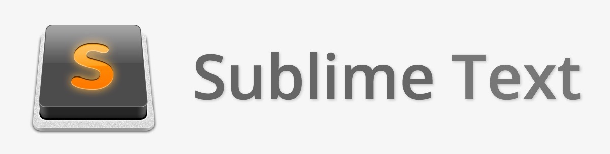

- [Introdução](#introdução)
- [Evolução dos Editores Gráficos](#evolução-dos-editores-gráficos)
- [Powered by Electron](#powered-by-electron)
- [Painel Lateral](#painel-lateral)
- [Command Pallete](#command-pallete)
- [Column Selection](#column-selection)
- [Add Next Occurence](#add-next-occurence)
- [Line Comment](#line-comment)
- [Screencast Mode](#screencast-mode)
- [Split Screen](#split-screen)
- [Terminal Integrado](#terminal-integrado)
- [Snippets & Emmet](#snippets--emmet)
- [Integração Nativa com Git](#integração-nativa-com-git)
	- [Iniciar um repositório](#iniciar-um-repositório)
	- [Sistema de Branch](#sistema-de-branch)
	- [Staging & Status](#staging--status)
	- [Atualizações do Arquivo](#atualizações-do-arquivo)
	- [Histórico de Commits (via Extensão)](#histórico-de-commits-via-extensão)
- [Extensões e Temas](#extensões-e-temas)
- [Live Share (Extensão Oficial)](#live-share-extensão-oficial)
- [Remote Development (Extensão Oficial)](#remote-development-extensão-oficial)
	- [Exemplo SSH](#exemplo-ssh)
- [Debugger & Run](#debugger--run)
- [Indicações & Sugestões](#indicações--sugestões)
	- [Configurações](#configurações)
	- [Extensões Essenciais](#extensões-essenciais)
		- [Bracket Pair Colorizer 2](#bracket-pair-colorizer-2)
		- [indent-rainbow](#indent-rainbow)
		- [Live Share Extension Pack](#live-share-extension-pack)
		- [Remote Development Extension Pack](#remote-development-extension-pack)
		- [Settings Sync](#settings-sync)
		- [Trailing Spaces](#trailing-spaces)
		- [Paste JSON as Code](#paste-json-as-code)
		- [YAML](#yaml)
		- [Better TOML](#better-toml)
		- [Test Explorer UI](#test-explorer-ui)
		- [Path Intellisense](#path-intellisense)
		- [Markdown All in One](#markdown-all-in-one)
		- [DotENV](#dotenv)
		- [EditorConfig for VS Code](#editorconfig-for-vs-code)
		- [GistPad](#gistpad)
		- [Git History](#git-history)
		- [GitLens — Git supercharged](#gitlens--git-supercharged)
		- [gitignore ou .gitignore Generator](#gitignore-ou-gitignore-generator)
		- [colorize](#colorize)
		- [Code Time](#code-time)
	- [Temas](#temas)
		- [Material Icon Theme](#material-icon-theme)
		- [Monokai Night Theme](#monokai-night-theme)
		- [2077 theme](#2077-theme)
		- [Outrun](#outrun)
		- [Shades of Purple](#shades-of-purple)
		- [Night Owl](#night-owl)
		- [One Dark Pro](#one-dark-pro)
		- [Material Theme](#material-theme)
		- [Winter is Coming Theme](#winter-is-coming-theme)
		- [Outras Opções](#outras-opções)

# Introdução

Essa apresentação serve como uma demonstração básica de algumas funcionalidades e do poder do Visual Studio Code.

# Evolução dos Editores Gráficos

Nos últimos anos eu trabalhei com os 3 editores e acredito que os 3, em sequencia, representam uma evolução [dos editores]. Todos são Cross-Platform.




# Powered by Electron

Uma curiosidade, tanto o Atom quanto o VS Code funcionam por causa do "Electron".

Em termos simples, o Electron permite você transformar uma aplicação Web em Desktop.


Inclusive sendo possível "inspecionar" o editor como se fosse uma página Web


# Painel Lateral


# Command Pallete

O Atalho mais importante do VS Code: `F1` ou `Ctrl + Shift + P` . Com ele, você consegue chamar qualquer funcionalidade do editor. Praticamente não é necessário decorar muitos outros atalhos.


Podemos usar essa interface, inclusive, para converter a "Indentation" ou "reindent" seu código automaticamente. Se for algo que use muito, pode criar atalhos personalizados tambem.


Outra variante do Command Pallete é o `Ctrl + P`. (ou você pode simplesmente remover o caractere `>` do barra de busca do comando original `Ctrl + Shift + P`)


Com ela, é possível irmos pra outro arquivo, outra linha, ou diretamente para uma função.


# Column Selection

Usando o `scroll` do mouse é possível fazer uma seleção múltipla verticalmente. Acredite, será útil.


Confira a pasta `videos` do repositório para uma pequena demonstração.

# Add Next Occurence

O segundo Atalho mais importante. Usando o atalho `Ctrl + D` é possível "ir marcando" vários matches da seleção.


# Line Comment

O terceiro atalho mais importante, `Ctrl + ;` . Rapidamente comente/"descomente" uma linha ou varias linhas de código.


# Screencast Mode

Esse modo fica mostrando as tecladas digitadas, assim como cliques do mouse. Perfeito para dar aula ou criar videos de tutorial.


# Split Screen

Além do Icone no canto superior direito, tambem é possivel dividir a tela, conforme desejar, arrastando as abas para o local desejado.


# Terminal Integrado

Apertando `Ctrl + '` é possível abrir o Terminal Integrado. Se você estiver trabalhando dentro de uma pasta, ele já abre dentro daquele diretório.


Também é possível dividir a tela dos terminais


# Snippets & Emmet

Snippets são "atalhos" de código. Apenas digitando palavras chaves, temos a opção de autocompletar que já implementa toda a estrutura do que queremos fazer.

O VS Code não possui nativamente snippets de todas as linguagens mas podemos expandir essa funcionalidade instalando extensões específicas de uma linguagem. Também é possível criar seus próprios snippets.


Emmet é uma extensão famosa estilo snippets para tecnologias Web e já vem integrado no Editor.

```html
ul>li*5
```

```html
<ul>
    <li></li>
    <li></li>
    <li></li>
    <li></li>
    <li></li>
</ul>
```


# Integração Nativa com Git

## Iniciar um repositório


## Sistema de Branch


## Staging & Status


## Atualizações do Arquivo


## Histórico de Commits (via Extensão)


# Extensões e Temas

Extensões expandem as funcionalidades do editor, como suporte de sintaxe para diversas linguagens, snippets, temas e outros.


# Live Share (Extensão Oficial)

Com o LiveShare é possível colaborar, gratuitamente, o código. Igual a ideia do Google Docs.

Também disponível comunicação via chat e audio.


O LiveShare pode ser usado também em conjunto com a IDE "Visual Studio 2019"


Caso queira permitir acesso remoto ao Debugger


# Remote Development (Extensão Oficial)

Você pode acessar ambientes externos via SSH, Container e WSL.


## Exemplo SSH

Ativamos servidor SSH em uma máquina Linux e obtemos seu IP


Registramos a conexão no VS Code e conectamos.


Também é possível configurar o acesso com chave de acesso SSH


Primeiro geramos as chaves na nossa maquina (Exemplo Windows):

```powershell
ssh-keygen -t rsa -b 4096 -f %USERPROFILE%/.ssh/id_rsa-remote-ssh
```

E depois enviamos a chave publica para a máquina destino (Nesse exemplo, Ubuntu). Nesse exemplo, ela está salva no arquivo `~/.ssh/authorized_keys` .

Acesso feito, agora é possível, com facilidade, editar os arquivos da máquina linux, de dentro do nosso VS Code.


Podemos também, rodar códigos.


> Mais Informações:
> - [https://code.visualstudio.com/docs/remote/ssh](https://code.visualstudio.com/docs/remote/ssh)
> - [https://code.visualstudio.com/blogs/2019/10/03/remote-ssh-tips-and-tricks](https://code.visualstudio.com/blogs/2019/10/03/remote-ssh-tips-and-tricks)
> - [https://code.visualstudio.com/docs/remote/troubleshooting](https://code.visualstudio.com/docs/remote/troubleshooting)
> - [https://dev.to/dre4success/ssh-to-an-ec2-instance-from-vs-code-2707](https://dev.to/dre4success/ssh-to-an-ec2-instance-from-vs-code-2707)
> - [https://medium.com/@christyjacob4/using-vscode-remotely-on-an-ec2-instance-7822c4032cff](https://medium.com/@christyjacob4/using-vscode-remotely-on-an-ec2-instance-7822c4032cff)


# Debugger & Run

Embora o VS Code não seja uma IDE, é possível rodar diversas linguagens e o Debugger. A Maioria das linguagens de forma quase nativa, outras como C/C++, com um pouco de configuração.


# Indicações & Sugestões

## Configurações


Desmarque


Configure conforme gosto. Não interfere no código


Essa ultima configuração varia bastante de gosto. Quando ativada, ela gera uma "seleção visual" em todas as ocorrências da palavra onde se encontra o cursor. Eu prefiro que o Editor faça isso APENAS se eu tiver selecionado a palavra.


## Extensões Essenciais

### [Bracket Pair Colorizer 2](https://marketplace.visualstudio.com/items?itemName=CoenraadS.bracket-pair-colorizer-2)

Ajuda a identificar os pares de chaves e parênteses com cores.


### [indent-rainbow](https://marketplace.visualstudio.com/items?itemName=oderwat.indent-rainbow)

Essa extensão coloriza o recuo na frente do seu texto alternando quatro cores diferentes em cada etapa.


### [Live Share Extension Pack](https://marketplace.visualstudio.com/items?itemName=MS-vsliveshare.vsliveshare-pack)

Este pacote de extensão inclui tudo o que você precisa para começar a colaboração em tempo real, incluindo chat por áudio e texto integrado.


### [Remote Development Extension Pack](https://marketplace.visualstudio.com/items?itemName=ms-vscode-remote.vscode-remote-extensionpack)

Permite abrir qualquer pasta em um contêiner, em uma máquina remota ou no Windows Subsystem for Linux (WSL)


### [Settings Sync](https://marketplace.visualstudio.com/items?itemName=Shan.code-settings-sync)

Permite sincronizar extensões, configurações e outros, entre diferentes instalações do VS Code.


OBS: Atualmente em testes, o VSCode está desenvolvendo funcionalidade similar. [https://code.visualstudio.com/docs/editor/settings-sync](https://code.visualstudio.com/docs/editor/settings-sync)

### [Trailing Spaces](https://marketplace.visualstudio.com/items?itemName=shardulm94.trailing-spaces)

Exibe espaços extras ao final da linha.


### [Paste JSON as Code](https://marketplace.visualstudio.com/items?itemName=quicktype.quicktype)

Converte JSON em estruturas de dados


### [YAML](https://marketplace.visualstudio.com/items?itemName=redhat.vscode-yaml)

Suporte para o arquivo de configuração YAML

### [Better TOML](https://marketplace.visualstudio.com/items?itemName=bungcip.better-toml)

Suporte para o arquivo de configuração TOML


### [Test Explorer UI](https://marketplace.visualstudio.com/items?itemName=hbenl.vscode-test-explorer)

Esta extensão fornece uma interface de usuário extensível para executar seus testes no VS Code. Pode ser usado com qualquer Framework de teste se houver uma extensão correspondente de "Test Adapter".


### [Path Intellisense](https://marketplace.visualstudio.com/items?itemName=christian-kohler.path-intellisense)

Auto completa nomes de arquivos

### [Markdown All in One](https://marketplace.visualstudio.com/items?itemName=yzhang.markdown-all-in-one)

Várias funcionalidades interessantes para se trabalhar com Markdown

### [DotENV](https://marketplace.visualstudio.com/items?itemName=mikestead.dotenv)

Suporte a syntax de arquivo .env


### [EditorConfig for VS Code](https://marketplace.visualstudio.com/items?itemName=EditorConfig.EditorConfig)

Ajuda a manter estilos de codificação consistentes para vários desenvolvedores que trabalham no mesmo projeto em vários editores e IDEs.

Os arquivos EditorConfig são facilmente legíveis e funcionam bem com os sistemas de controle de versão. Arquivo exemplo: [https://editorconfig.org/](https://editorconfig.org/)


### [GistPad](https://marketplace.visualstudio.com/items?itemName=vsls-contrib.gistfs)

Permite gerenciar GistHub Gists dentro do editor. Você pode abrir, criar, excluir, editar, favoritar e clonar.


### [Git History](https://marketplace.visualstudio.com/items?itemName=donjayamanne.githistory)


### [GitLens — Git supercharged](https://marketplace.visualstudio.com/items?itemName=eamodio.gitlens)

Adiciona Code Lens, Line Blame, Line Hovers, entre outros.


### [gitignore](https://marketplace.visualstudio.com/items?itemName=codezombiech.gitignore) ou [.gitignore Generator](https://marketplace.visualstudio.com/items?itemName=piotrpalarz.vscode-gitignore-generator)

Permite criar gitignore completos e específicos por linguagem ou frameworks.

Arquivos exemplos disponivel tambem no repositorio oficial do Github: [https://github.com/github/gitignore](https://github.com/github/gitignore)


### [colorize](https://marketplace.visualstudio.com/items?itemName=kamikillerto.vscode-colorize)

Colore as marcações de Cor em arquivos de estilos, de acordo com a cor especificada.


### [Code Time](https://marketplace.visualstudio.com/items?itemName=softwaredotcom.swdc-vscode)

Métricas


## Temas

### [Material Icon Theme](https://marketplace.visualstudio.com/items?itemName=PKief.material-icon-theme)

Ícones para Extensões e Arquivos.

Exemplo:


### [Monokai Night Theme](https://marketplace.visualstudio.com/items?itemName=fabiospampinato.vscode-monokai-night)


### [2077 theme](https://marketplace.visualstudio.com/items?itemName=Endormi.2077-theme)

Cyberpunk 2077 inspired theme


### [Outrun](https://marketplace.visualstudio.com/items?itemName=samrapdev.outrun)


### [Shades of Purple](https://marketplace.visualstudio.com/items?itemName=ahmadawais.shades-of-purple)


### [Night Owl](https://marketplace.visualstudio.com/items?itemName=sdras.night-owl)


### [One Dark Pro](https://marketplace.visualstudio.com/items?itemName=zhuangtongfa.Material-theme)


### [Material Theme](https://marketplace.visualstudio.com/items?itemName=Equinusocio.vsc-material-theme)


### [Winter is Coming Theme](https://marketplace.visualstudio.com/items?itemName=johnpapa.winteriscoming)


### Outras Opções

[https://vscodethemes.com/](https://vscodethemes.com/)
